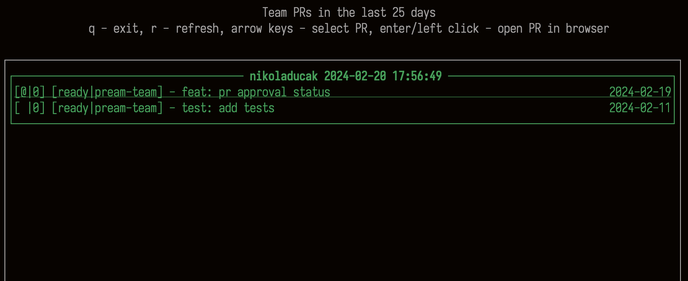

# PReam-Team
A TUI utility that lists open github PRs for your team.


# Get it
```
python3 -m pip install  pream-team --upgrade
```

# How to
You need a GitHub personal access token with full repo scope
and with admin org read access if you want to specify `org` value.

Besides the token you also need to provide a list of github usernames. You can do that through command line:


```
options:
  -h, --help            show this help message and exit
  --names NAMES [NAMES ...]
                        List of GitHub usernames.
  --days DAYS           Number of past days to search for PRs.
  --token TOKEN         GitHub API token.
  --org ORG             GitHub organization name.
  --file FILE           Path to YAML file containing 'names', 'days', 'token' and 'org' fields. (Note that command line
                        arguments override YAML file configuration)
```

Or through a yaml file (default location is ~/.prs/config.yml):

```
org: some-org # optional
token: some-token # required
days-back: 25 # optional
names: # required (at least one)
  - "Teamamte-username-1"
  - "Teamamte-username-2"
  - "Teamamte-username-3"
```
